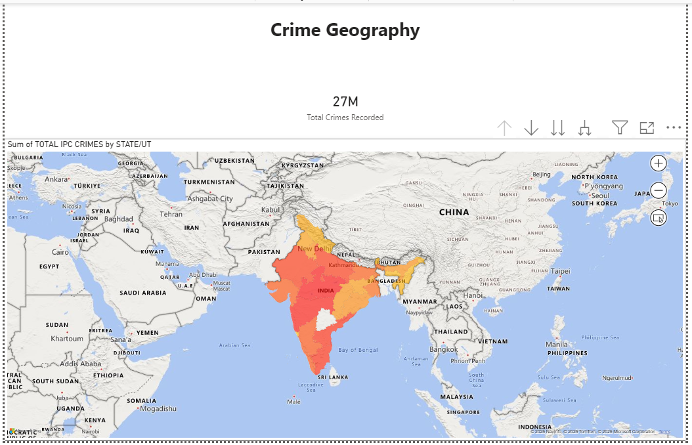
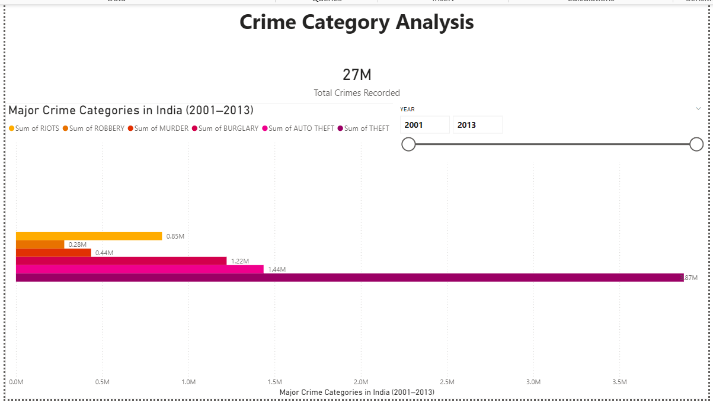
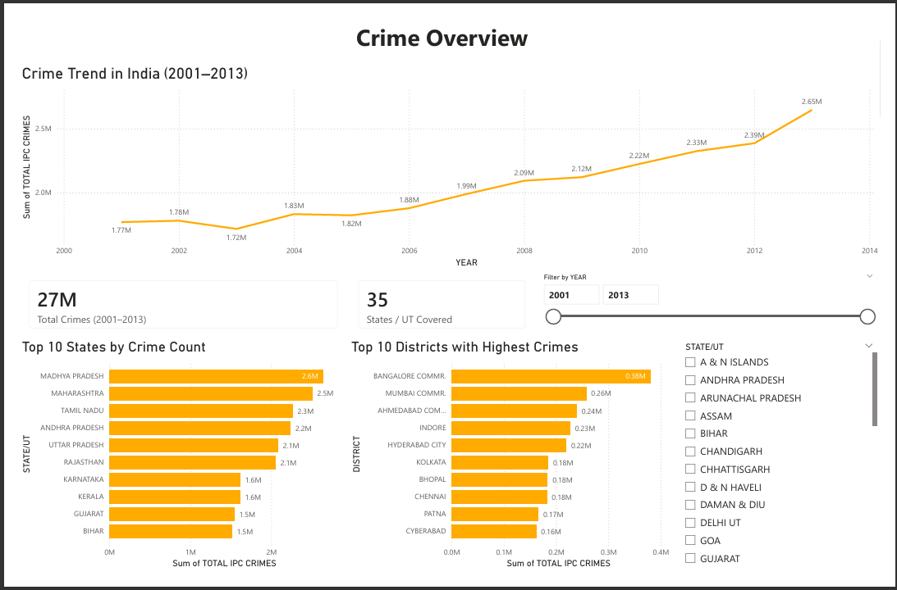

# India Crime Intelligence Dashboard (2001–2013)

An end-to-end data analytics project analyzing district-level crime data in India using Python and Power BI.

This project explores historical crime patterns to identify high-crime regions, dominant crime categories, and long-term trends between 2001 and 2013.

---

## Project Overview

The objective of this project is to:

- Analyze crime distribution across Indian states and districts  
- Identify states with the highest reported crime totals  
- Examine crime trends over time  
- Determine the most common crime categories  
- Measure crime growth between 2001 and 2013  
- Build an interactive dashboard for visualization  

---

## Tools and Technologies

- Python  
  - Pandas  
  - NumPy  
  - Matplotlib  
  - Seaborn  
- Power BI  
- Git and GitHub  
- Jupyter Notebook  

---

## Dataset

The dataset contains district-level crime statistics reported under the Indian Penal Code (IPC) from 2001 to 2013.

Each record includes:

- State / Union Territory  
- District  
- Year  
- Individual crime categories  
- Total IPC crimes  

Note: The dataset includes records only up to 2013. The purpose of this project is to analyze structural and historical patterns rather than current crime statistics.

---

## Data Cleaning Process

The following steps were performed in Python:

- Removed summary rows such as “TOTAL” and “ZZ” to avoid double counting  
- Standardized state names  
- Aggregated crime totals at state and district levels  
- Generated a cleaned dataset for dashboard development  

The cleaned dataset is available in:

data/cleaned/clean_crime_data.csv

---

## Key Insights

- Crime levels show a steady upward trend from 2001 to 2013  
- Large states such as Madhya Pradesh and Maharashtra report the highest total crime counts  
- Property crimes (such as theft and auto theft) dominate overall statistics  
- Major metropolitan districts account for a significant share of reported crimes  
- Certain crime categories experienced substantial growth over the study period  

---

## Dashboard Preview

### Crime Distribution Map

### Crime Category Analysis

### State-Level Overview

---

## Project Structure

india-crime-intelligence-dashboard/
│
├── dashboards/
│ └── crime_intelligence_dashboard.pbix
│
├── data/
│ ├── raw/
│ │ └── Crimes_in_india_2001-2013.csv
│ └── cleaned/
│ └── clean_crime_data.csv
│
├── images/
│ ├── crime_overview.png
│ ├── crime_category.png
│ └── crime_map.png
│
├── notebooks/
│ └── crime_analysis.ipynb
│
├── README.md
└── requirements.txt

---

## How to Run

1. Clone the repository:

git clone https://github.com/Harshal7342/india-crime-intelligence-dashboard.git

2. Install dependencies:

pip install -r requirements.txt

3. Open the Jupyter Notebook:

notebooks/crime_analysis.ipynb

4. Open the Power BI dashboard:

dashboards/crime_intelligence_dashboard.pbix

---

## Future Improvements

- Incorporate post-2013 updated crime data  
- Analyze population-adjusted crime rates  
- Deploy the dashboard using Power BI Service  
- Extend analysis with predictive modeling  

---

## Author

Harshal Mahajan  
Aspiring Data Analyst